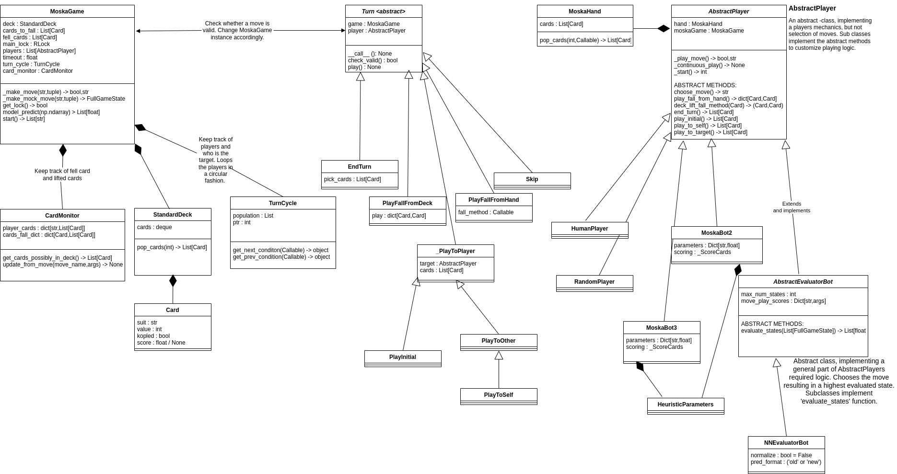
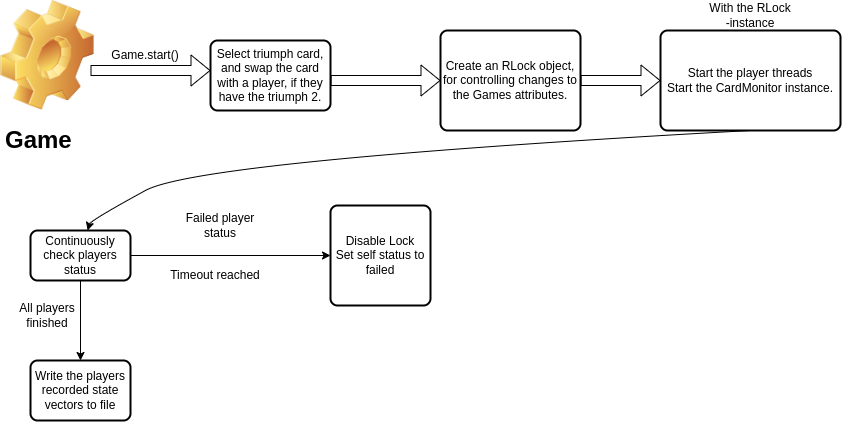

# Moska Card game simulator

## **General** <!-- omit in toc -->
This repository is about a hidden information, non-sequential multiplayer game called 'Moska', which is popular in some parts of Finland. This repository contains a game engine, abstract player interfaces and implemented players. Moska is a cousin to the more popular russian card game "Durak", but played with a full deck, and a variation of the rules.

The aim of this project is to create an agent, which plays near a human level. The general approach is to use deep neural networks to evaluate how good a position is from a certain players perspective. The neural network is trained on data acquired from simulations with hand-made agents, where each players states are recorded through-out the game, and after the game each recorded state is labeled according to whether the player lost (0) or did not lose (1). The neural network is then implemented on a player, which uses the neural network to evaluate each possible next move, and greedily choose the best with no look-ahead.

## **Usage** <!-- omit in toc -->
Tested on Python version 3.6, 3.8, 3.9 and 3.10. **Version 3.11 does not work!**

To get set up, clone this repository, for example with the command: `git clone https://github.com/ilmari99/moska.git`.

Move to the created directory (`cd moska`), and run `pip install -r play-requirements.txt` to install the required packages for most agents. To install all required packages, install the `requirements.txt`.

### **Play games**
To play games against three neural network players, run `python3 ./Play/play_as_human.py` (just `py ./Play/play_as_human.py` on Windows).

When playing, you can the evaluation of your current state. The evaluation has perfect memory about the played cards, and which cards each player has lifted. As a player, if you want, you can scroll back and see whether some cards were already played.

The players turns are assigned pseudo-randomly, and there is no speed aspect to this version (since computer is much faster).

Everything in the game happens by selecting a number, that references to something (index).
When the game begins, the players start playing. When you can play, the game automatically stops, and the command line then presents you with information about the current game state (the `(TG)` next to a player means, that the player is the target), and the possible moves (classes of moves). The numbers next to each player tell how many cards they have in their hand. For example:
```
Human playing...
Triumph card: ♦12
Deck left: 11
NNEV1           : 6
NNEV2           : 6
NNEV3           : 6
Human (TG)(0.41): 6
Cards to fall : [♥8]
Fell cards : []

{'target': 'Human', 'cards_to_fall': [♥8], 'fell_cards': [], 'hand': ♠9 ♠8 ♣9 ♣4 ♠13 ♥9 , 'Deck': 11}
0. EndTurn
1. PlayToSelf
2. PlayFallFromHand
3. PlayFallFromDeck
What do you want to play:
Which cards do you want to play to self (indices of cards in hand separated by space):
1
```
You choose a move, and select the cards to play.
For example, I want to play ♠8 to myself, so I first choose the move `1. PlayToSelf` by typing `1`. After that, I select the index of the card I want (in `'hand': ♠9 ♠8 ♣9 ♣4 ♠13 ♥9`) to play to myself, in this case the index is `1`. The game then continues, and the next player plays, and so on.
The command line generally instructs you how to make a move, and the game shouldn't fail even if you make a mistake. Once you play a move, you can't undo it, but don't worry that is normal in moska.
A specific note: If you fall cards on the table, with cards in your hand, you must do it by specifying two cards: one from your hand, and the other from `Cards to fall` as a tuple of two indices `(a,b)`.

The game can be stopped at any time by pressing `Ctrl+C`.

To customize which players to play against, see the file `./Play/play_as_human.py` and change the players to your liking. This might require you to look at the `__init__` method of your chosen player, to see which arguments are required. There is little documentation currently, and error handling might not be very informative - sorry about that!

### **Training a model**
Simulated data can be found from Kaggle: https://www.kaggle.com/datasets/ilmarivahteristo/card-game-state-evaluation.

To create your own simulated data, see the `./Play/create_dataset.py`.

Training a good model likely requires a large dataset. Best model so far, used roughly 1M games, and 70 M examples, resulting in 72% accuracy on the test set, and a binary cross entropy loss of 0.5081.

Recently CNNs have been attempted both on the full state vector, or creating a separate CNN branch which only performs convolutions for the part of the state vector containing information about cards. The tried CNNs seem to easily overfit, despite a large (1M games, 70M examples) dataset.

To train a model, it easiest to modify `./Analysis/train_model.py` according to your needs, and then run `./Scripts/train_model.sh <new-folder-name>` (on Linux). For example, to customize the model architecture and the used folders. The script runs the training in the background with the `nohup` -command. The script creates a new folder, and copies the `train_model.py` file there, saves the training output to a `.log` file and stores the tensorboard log there too. This makes it easier to keep track of the tried models and their results.

### **Run a benchmark**
To run a pre-defined benchmark, see the file `./Play/benchmark_model.py` and change the desired player type and corresponding arguments. Then run `python3 ./Play/benchmark_model.py`. There are currently three benchmarks available.

### **Implementing custom players**


*Flowchart of the players logic. Abstract classes implement the necessary stuff required for using the agent - except selecting the move to play.*

The agents can either implement `Moska/Player/AbstractHIFEvaluatorBot.py`, `Moska/Player/AbstractEvaluatorBot.py` or `Moska/Player/AbstractPlayer.py`.

**AbstractPlayer**

NOTE: Do not modify any existing variables, when selecting a move, as this makes the behaviour undefined and will result in an error.

The `AbstractPlayer` is the base class of all agents. It contains the general logic of the player, and some helper methods. The following logic needs to be implemented by the subclasses of `AbstractPlayer`:
- `choose_move(playable_moves : List[str]) -> str` : Choose which class of plays to make (e.g. `InitialPlay`, `PlayToSelf`, `PlayToTarget` etc.). To help, the input to the function contains the moves (str), for which there is a valid move to make.
- `end_turn() -> List[Card]` : Which cards to pick up, when you decide to end your turn.
- `play_fall_card_from_hand() : Dict[Card,Card]` : Which card to play from hand to which card on the table.
- `deck_lift_fall_method(card_from_deck : Card) -> (Card,Card)` : When playing from deck, IF the card can fall a card on the table, which card it should fall. The input is the card from deck.
- `play_to_self() -> List[Card]` : Which cards to play to self.
- `play_initial() -> List[Card]` : Which cards to play on an initiating turn.
- `play_to_target() -> List[Card]` : Which cards to play to target.

The agents implementing the `AbstractPlayer` class can try to play illegal moves if the methods are implemented incorrectly, but they should eventually be designed to only make valid moves, to improve performance. Also, if the player is fully deterministic, and it can make invalid moves, the game will timeout, because an Agent is only making invalid moves and the game will never end, since the agent will get into a loop of attempting to play the same move.

Agents only implementing the AbstractPlayer, can be made significantly faster than the `AbstractEvaluatorBot`, because they do not need to generate all possible plays.

**AbstractEvaluatorBot and AbstractHIFEvaluatorBot**

The `AbstractEvaluatorBot` class is a subclass of `AbstractPlayer`. It creates all the possible next states (`FullGameState` instances), from the current state. The `AbstractEvaluatorBot` does not play by the rules, since it knows the immediate next state (i.e. which cards it picked from the deck), except for playing from deck. It is used in simulations, to make them faster while maintaining this *evaluation logic*.

The `AbstractHIFEvaluatorBot` is a subclass of `AbstractEvaluatorBot`. It is not certain about the immediate next state of the game, when there is uncertainty, but only has the same information as a human (with perfect memory). If there is uncertainty, it samples a number of possible next states, and uses the evaluation mean of the sampled states as the score for a particular move.

Agents implemented with the `AbstractEvaluatorBot` class are slower, but easier to make and understand. They are slower, because they generate all the possible next states, and then evaluate them. For large hands, or tables, the number of different plays gets very large.

The neural networks are specifically used with this class.


## Table of Contents <!-- omit in toc -->
- [Moska Card game simulator](#moska-card-game-simulator)
  - [**1 Introduction**](#1-introduction)
    - [**1.1 Games and hidden information**](#11-games-and-hidden-information)
    - [**1.2 Evaluation function**](#12-evaluation-function)
    - [**1.3 Moska card game**](#13-moska-card-game)
  - [**Appendix**](#appendix)
    - [**1 Introduction to Moska**](#1-introduction-to-moska)
      - [**Goal**](#goal)
      - [**Dealing**](#dealing)
      - [**Flow of the game**](#flow-of-the-game)
      - [**General techniques**](#general-techniques)
    - [**3 Simulation**](#3-simulation)
      - [**In general**](#in-general)
      - [**Agent interfaces**](#agent-interfaces)
    - [**Players based on heuristics**](#players-based-on-heuristics)
    - [**Players based on Neural Network evaluations**](#players-based-on-neural-network-evaluations)
  - [Data collection](#data-collection)
  - [Neural network](#neural-network)
  - [TODO LIST](#todo-list)


## **1 Introduction**
### **Moska**


### **1.2 Evaluation function**
Evaluation function is a function, that evaluates a game state. Evaluation functions can be hand-crafted or learned from data. For complex games, good evaluation functions can be very hard to create. Usually a hand-crafted evaluation function is a linear combination of features, that are extracted from the game state, and then weighted.

A hand-crafted evaluation function was created by selecting numerical features of the game state and weighing the features. The weights were optimized, by minimizing the probability to lose.

Evaluation functions can also be learned from data, by training a neural network. If data is available, the evaluation function can be trained directly from human games, and later iteratively improved with self-play. If data is not available, agent based modelling can be used to simulate games, and gather data from the simulated games. The evaluation function can then be trained with supervised learning.

An evaluation function is a central piece in many game playing algorithms, as well as in this project.

Because there is no data from human games for the Moska card game, I use agent based modelling to simulate games with hand-crafted agents and gather data from these simulated games to model the evaluation function with a neural network.

### **1.3 Moska card game**

Moska is a non-sequential, hidden information game. The game is played with a standard 52 card deck, and 2-8 players. The goal of the game is to not be the last player with cards in hand.

Moska is a traditional Eastern finnish card game that is popular for example in Lappeenranta University of Technology ([Moska tournament](https://www.facebook.com/events/509820004449991/?ref=newsfeed)) and Tampere University ([Rules found on TARAK associations website](https://www.taraki.fi/opiskelijalle/moska/)). 

Moska shares similarities with the popular russian game *"Durak"* and another finnish game called *"Musta Maija"* (Black Mary). Moska is arguably more complex than Durak, due to the fact that Moska is played with a full standard deck instead of 36 cards, allows playing directly from the deck, and allows players to play cards to themselves. Moska is also considered to be more complex than Black Mary [Korttipeliopas: Moska](https://korttipeliopas.fi/moska).

I focus on a Moska game of 4 player game, to have a constant input shape for the neural network, and to balance the preparation period and the end-game. The rules and general strategy of the game are explained later.

The simulation engine implements the version, that is most popular in LUT university among Computational Engineering students, with a a few changes detailed later.

## **Appendix**
### **1 Introduction to Moska**
The rules in english, are the rules, that are played most commonly in Lappeenranta university of technology among Computational Engineering students.

Rules in finnish: https://korttipeliopas.fi/moska

#### **Goal**
The goal of the game is to not be the last player with cards in hand. The game consist of attacks and defences. One of the players is always the target, and other players are the attackers.

#### **Dealing**
At the beginning of the game, each player is dealt 6 cards. The next card in the deck will be lifted and the suit will be chosen as the triumph suit.
If a player has the 2 of the triumph suit in their initial hand, he can switch it with the triumph card of the deck (getting a larger triumph card in exchange), before the game starts.
The ace is the highest card (14), and 2 is the lowest card.

#### **Flow of the game**
**Initiating a turn**

At each stage, one player is the target. The player on the targets right hand side is the initiating player. The initiating player can play any single card, multiple cards of the same value, or combinations of multiple cards. For example valid moves could be: (♥2) OR (♠14) OR (♠5, ♣5) OR (♠8, ♣8, ♥8, ♠10, ♣10).

**Attacking**

After the turn is initiated, every player can attack the target, but the cards played MUST have the same value as some card currently on the table.

Attackers can play cards to the target, as long as there are at most as many un-fallen cards on the table, as the target has cards in hand.

Each attacker fills their hand to 6 cards from the deck (if there is deck left) immediately after playing the cards. The target will not fill their hand.

**Defending**

*Falling a card*

The target can defend himself by falling a card on the table, with a greater card of the same suit, or any card of the triumph suit (unless the card to fall is also a triumph).

*Playing cards to self*

The target can also play cards to themselves to get rid of bad cards and limit the number of cards others can play. The target can ONLY play cards to themselves if there was deck left at the beginning of their turn. Also, similar to attackers they can only play cards of the same value as some card currently on the table.

*Playing from deck*

The target can also choose to pick the top card of the deck to fall a card on the table. If the picked card can fall any card on the table, the picked card must be used to fall a card. If the picked card can not fall any card on the table the card is left to the table as if an attacker had played it. The player can not pick the top card of the deck, if they have already picked a card from the deck during their turn and the card is still un-fallen on the table.

**Ending the turn**

The target can end their turn once every player has confirmed that they do not want to play more cards. At the end of the turn, the target must pick either all fallen cards (as well as the cards used to fall the card) and all un-fallen cards from the table or only pick un-fallen cards from the table. The target must also fill their hand to 6 cards from the deck if they have less than 6 cards in hand.
If the target doesn't have to pick any cards, the player on the targets right hand side is the new target and the current target is the new initiating player.
If the target has to or chooses to pick cards, the player on the targets left hand side is the new initiating player and the player on the new targets left hand side is the new target.

**Ending the game**

When the deck is finished, the game continues as before. In this stage, players attempt to play their cards intelligently, so they will not be the last player with cards in hand. The last person with cards in hand is the loser.


#### **General techniques**
The game can be though of as having 2 phases:
- Preparation phase
- End-game phase

**Preparation phase**
A game is in the preparation phase, when there are still cards in the deck.
In the preparation phase, players try to get a good hand for the end game. A good hand is a hand with high cards and combinations. This allows the player to kill cards played to them, and play multiple cards simultaneously to others. Personally, in this phase there are many variables to consider, and I just try to assess whether a move likely results in a better hand. The evaluation process is purely an approximation based on previous experience.
The end of the preparation phase is also important, since the triumph card is the bottom card on the deck (This is visible to all players). So the player who gets to lift the last card, is guaranteed to have the triumph card in their hand for the end-game.

An example of a simple evaluation process,

**Q:** *I could play 2 10s, neither is trump suit. Should I play them to get 2 random cards from the deck?*

**A:** *Usually, if I don't have a triumph card, I would play them for a chance at a triumph card. If I have a triumph card, I would probably not play them, since I would rather have a hand with this combination. This also depends on whether 10s have already been played and a number of other factors.*

**End-game phase**
The end-game phase starts when the deck is empty.
In the end-game phase, players try to get rid of their cards. In this phase, more logic, and knowledge from previous moves can be used (for example which cards a player has lifted), especially when the number of players left in the game is small (2-4). Players generally try to assess the future of the game in a Tree Search manner. This can be quite hard, since there is hidden information and the number of plays is usually too large for humans.

For a simple example,

**Q:** *All other players are finished, except me and 1 other. I have a triumph 10, and 2 5s (not triumph). The other player has 1 card. He is the target. How should I play my cards?*

**A:** *I can only play one card, since he only has one card in hand. If I play a card, that he can fall, then I lose. If I play my triumph 10 and he cant fall it, I win, because he has to lift the card, leaving him with 2 cards in hand. I can then play my pair of 5s and win.*


### **3 Simulation**


*A simplified UML diagram of the project.*
#### **In general**
The simulation is a parallelizable process, with players as threads. To make a move, a player thread acquires a lock (`threading.RLock` instance) of the game state, and calculates what it wants to play. It then calls a method of the Game instance with the desired arguments. The Game instance then checks if the move is valid, and if it is, it updates the game state. If the move is not valid, an assertion error is raised. The player then either tries to play again, or frees the lock and waits for the next turn.

The game was chosen to have a lock mechanic and players as threads, because in a real game the players do not have turns, but they make moves when they want to. This also enables us to measure the effect of delay for a players success.
The threading probably does not give a performance boost, since the threads can not make any calculations if the game state is locked, because there is no way to know whether the player having the lock is going to change the status of the game or not, and some references might be different if another thread is calculating moves due to the shared memory of the threads.

Note: The changing of the game state, and checking validity of moves, are calculated in the player threads, and not in the Game (main) thread. This doesn't matter, but coding wise it would've been better to make the Game a separate API.

The games are parallelized by using the `multiprocessing` library Pool. The games are then lazily mapped to the pool with a specified chunksize. The results are returned in order of finishing, with `Pool.imap_unordered`.

The speed of the simulation depends on the parallelization, algorithms used, and whether we are collecting data vectors. The bots using neural networks are considerably slower than the other bots. A tensorflow .h5 file must be converted to a .tflite file, to be used in the simulation. This is done by the `Analysis/convert-to-tflite.py` script. The tflite models are MUCH smaller and faster than using a tensorflow model.


*Flowchart of the games logic after starting a simulation.*


## Data collection
The data is created by playing games, and saving the state of the game from the perspective of the player. The data contains full card-counting information: Which cards have been discarded, and which players have lifted which cards.
After each game, the players recorded states are then labeled according to whether they lost (1 not lost, 0 lost). Many combinations and player arguments are used, to avoid a biased dataset.

The state of the game contains:
- The number of cards in the deck
- The number of cards in each players hand
- The counted cards for each player (If a player lifts cards, we know they have the card in hand until they play it away.)
- The cards on the table
- The cards that have been killed and the cards that have been used to kill them
- The players own cards
- Whether each player is ready
- Whether each player is still in the game
- Whether there is a card played from the deck on the table
- Which player is the target

The data is represented as an integer vector, where a set of cards (for example the current cards on the table) is represented as vector of length 52, where each index corresponds to a card. The cards are sorted by suit and value. Each card that is in the set, is then assigned a number representing how many cards the card can fall at the moment. For example, the triumph suit ace, would have a value of 51 if no cards have been discarded from the game. The encoded value is -1, if the card has been discarded from the game.

The data is then balanced, by taking a random sample from the measured not-losers. If we took the full dataset, the model would be biased towards not losing, since there is a 1/4 relation between the number of losers and not-losers. The data is balanced at the collection phase to also reduce the amount of data.

Each games state vectors and labels are shuffled and saved as a randomly named .out file, and the folder of files is read as a tensorflow TextLineDataset.

## TODO LIST
- Add TESTS!!
- Add better graphics
- Add GUI
- Add docs
- Add tree search
- Improve scripts
- Find a good Model architecture (Will settle for 72 %)
- Finish writing the thesis
- 
