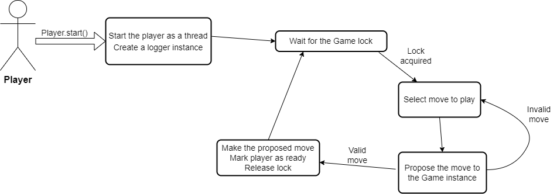

# Moska Card game simulator

## **General** <!-- omit in toc -->
This repository is about a hidden information, non-sequential multiplayer game called 'Moska', which is popular in some parts of Finland. This repository contains a game engine, abstract player interfaces and implemented players. Moska is a (distant) cousin to the more popular russian card game "Durak", but played with a full deck, and a quite big variation of the rules.

This repository contains a game engine and additional logic to simulate and gather data, multiple players (some might not be up-to date), and a crude web application. The web application is currently only for four player games, and is very simplistic.

The neural network agents were trained entirely based on simulations of Moska with weaker agents, and the agents have no additional information, except perfect memory of previous moves. The simulations are parallelizable, and scale well on a single node. Though data gathering is still in progress, we can confidently say that the create agent is atleast as good as humans.

Play the game against the created agents at https://moska-online.com/ !!

See the more about the project in `thesis.md`.

## Table of Contents <!-- omit in toc -->
- [**Usage**](#usage)
- [**Play games**](#play-games)
- [**Training a model**](#training-a-model)
- [**Run a benchmark**](#run-a-benchmark)
- [**Implementing custom players**](#implementing-custom-players)
- [**AbstractPlayer**](#abstractplayer)
- [**AbstractEvaluatorBot**](#abstractevaluatorbot)
- [**AbstractHIFEvaluatorBot**](#abstracthifevaluatorbot)

## **Usage** <!-- omit in toc -->
Tested on Python version 3.6, 3.8, 3.9 and 3.10. **Version 3.11 does not work for now!**

### **Play games**
To simply play games, visit https://moska-online.com/. The web application is very simplistic, and only supports four player games.

To start your own server, you need Firebase access.

To play on the command line, run `python3 ./Play/play_as_human.py`.

### **Training a model**
To create your own simulated data, see the `./Play/create_dataset.py`.

Training a good model likely requires a large dataset. Best model so far, used roughly 1M games, and 70 M examples, resulting in 73.5% accuracy on the test set, and a binary cross entropy loss of 0.5081.

To train a model, it easiest to modify `./Analysis/train_model.py` according to your needs, and then run `./Scripts/train_model.sh <new-folder-name>` (on Linux). For example, to customize the model architecture and the used folders. The script runs the training in the background with the `nohup` -command. The script creates a new folder, and copies the `train_model.py` file there, saves the training output to a `.log` file and stores the tensorboard log there too. This makes it easier to keep track of the tried models and their results.

### **Run a benchmark**
To run a pre-defined benchmark, see the file `./Play/benchmark_model.py` and change the desired player type and corresponding arguments. Then run `python3 ./Play/benchmark_model.py`. There are currently three benchmarks available.

### **Implementing custom players**

*Flowchart of the players logic. Abstract classes implement the necessary stuff required for using the agent - except selecting the move to play.*

The agents can either implement `Moska/Player/AbstractHIFEvaluatorBot.py`, `Moska/Player/AbstractEvaluatorBot.py` or `Moska/Player/AbstractPlayer.py`.

**AbstractPlayer**

NOTE: Do not modify any existing variables, when selecting a move, as this makes the behaviour undefined and will result in an error.
TODO: This should be checked for, and a more descriptive error message should be given.

The `AbstractPlayer` is the base class of all agents. It contains the general logic of the player, and some helper methods. The following logic needs to be implemented by the subclasses of `AbstractPlayer`:
- `choose_move(playable_moves : List[str]) -> str` : Choose which class of plays to make (e.g. `InitialPlay`, `PlayToSelf`, `PlayToTarget` etc.). To help, the input to the function contains the moves (str), for which there is a valid move to make.
- `end_turn() -> List[Card]` : Which cards to pick up, when you decide to end your turn.
- `play_fall_card_from_hand() : Dict[Card,Card]` : Which card to play from hand to which card on the table.
- `deck_lift_fall_method(card_from_deck : Card) -> (Card,Card)` : When playing from deck, IF the card can fall a card on the table, which card it should fall. The input is the card from deck.
- `play_to_self() -> List[Card]` : Which cards to play to self.
- `play_initial() -> List[Card]` : Which cards to play on an initiating turn.
- `play_to_target() -> List[Card]` : Which cards to play to target.

The agents implementing the `AbstractPlayer` class can try to play illegal moves if the methods are implemented incorrectly, but they should eventually be designed to only make valid moves, to improve performance. Also, if the player is fully deterministic, and it can make invalid moves, the game will timeout, because an Agent is only making invalid moves and the game will never end, since the agent will get into a loop of attempting to play the same move.

Agents only implementing the AbstractPlayer, can be made significantly faster than the `AbstractEvaluatorBot`, because they do not need to generate all possible plays.

### **AbstractPlayer**

The **AbstractPlayer** interface is the base class for all playing
agents. It implements the necessary logic to use an agent with the game
engine. Subclasses must implement logic to choose which class of moves
to play (for example, play to self, fall from hand, etc.), and the logic
to select the cards to play after deciding which class of moves to play.
The AbstractPlayer interface allows full customization of the playing
logic and possibly very fast simulations. For example MoskaBot3 (Bot3)
uses this interface.

### **AbstractEvaluatorBot**

The **AbstractEvaluatorBot** interface implements logic to generate the
possible legal moves, with fairly efficient combinatorial- and graph
algorithms. This implements the greedy logic (i.e. no look-ahead) of the
main approach. This interface only requires an instance to implement an
evaluation function, which takes in a list of game state objects, and
returns the evaluations corresponding to the states. If this interface
is used directly, the agent will have extra information about the future
state of the game. For example, when attacking another player, and you
must lift cards from the deck, it knows which cards one is going to
lift. A similar interface is the **AbstractHIFEvaluatorBot**, which
hides the excess information by sampling a number of possible immediate
next states and using the average evaluation of the samples as its
evaluation for a move. For this reason, AbstractEvaluatorBot is faster
and designed for simulations, but not realistic.

Two important classes, that use this logic, are NNHIFEvaluatorBot
(NN-HIF) and NNEvaluatorBot (NN-MIF). NN-HIF implements
AbstractHIFEvaluatorBot, and is hence a realistic player, but NN-MIF
implements AbstractEvaluatorBot, making it better and faster, but having
unrealistic information.

## TODO LIST
- Add TESTS!!
- Add docs
- Add tree search
- Improve scripts
- Game state as json
- Separate Game class for browser games
- Website is shit
