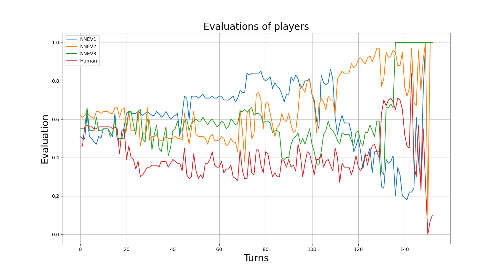

# INTRODUCTION

**NOTE: This was automatically generated from the thesis source files and parsed, it may not be up to date, is missing sections and algorithms, and may contain weird and ugly things.**

## **Moska**

Moska is a small finnish card game, that has likely originated from the
more popular russian card game Durak. Moska is more complex than durak,
since it is played with a full deck, the target can play directly from
the deck, the attacking turns are not sequential, and the target player
can attack himself. In this section, I will briefly go through the main
rules of the game. For a more detailed description, see the appendix.

### **Short rules**

Lets first make some terminology for the game:

-   **Target** is the player to who cards are played to.

-   **Attacker** is a player who plays cards to the target from their
    hand.

-   **Killing** is the targets way to get rid of cards that have been
    used in an attack. Card A can ’kill’ card B, if card A has a higher
    rank than card B and they are of the same suit, or card A is trump
    and B is not.

-   **Trump suit** is the suit of cards, that can kill any card despite
    its rank, unless the card to kill is also of trump suit.

-   **Table** is the place where all the cards played on the current
    targets turn are. It consists of not-killed cards and killed cards
    (which also contains the cards that were used to kill).

Each player is dealt 6 cards in the beginning of the game. The first
target is chosen randomly (or the last games loser is the first target).
The player on the targets right hand side initiates the game by playing
any single card to the target, or multiple cards of same rank, or
multiple multiple cards of the same rank.

After the player on the targets right hand side has attacked, every
player can freely (non-sequentially) attack, given that a card with the
same rank is already on the table, and the number of (not-killed) cards
on the table is not greater than the number of cards in the targets
hand. If any attacker attacks, they must always fill their hand to six
from the deck, if there are cards in the deck.

The target can also attack himself if there was deck left when they
became the target, even if that would mean there are more not-killed
cards, than there are in the targets hand. When a player is target, they
do not fill their hand to 6 cards.

The target can freely kill not-killed cards. The card can either be
played from the top of the deck, or from the targets hand. If the card
is played from the deck, and it can’t kill any card on the table, the
card is left to the table as a not-killed card, and the target can’t
play from deck again until they kill the card with a card from their
hand.

When the target doesn’t want to kill anymore cards on the table (or
there are none), and none of the attackers want to attack anymore, the
target can end the turn by: picking nothing, picking the not-killed
cards, or picking every card on the table. If there are not-killed cards
on the table, the target must lift them. After ending their turn, the
target fills their hand to 6 cards from the deck if they need to. If the
target doesn’t lift any cards from the table one rotation is performed,
so the player on the targets left hand side is the new target, and the
previous target is the new initial attacker. If the target lifts any
cards from the table, two rotations are performed, so the second player
from the targets left side becomes the target.

The objective of the players is to not be the last person with cards in
their hand. The specifics of the rules are fairly complex, but the
general idea is quite simple.

### **Complexity**

Game tree complexity is the size of a tree-search needed to evaluate the
initial position, and can be estimated by calculating the average number
of possible moves from a position (branching factor) and the average
length of the game. For example the estimated game tree complexity of
Chess is 3580 ≈ 10123.

Moska is fairly complex, but isn’t really comparable to chess at least
in terms of game tree complexity. From simulations, we observed that the
game tree complexity goes down, as the number of players is increased,
which is expected. Complexities for each possible number of players can
be seen in figure
<a href="#fig:game-tree-complexity" data-reference-type="ref"
data-reference="fig:game-tree-complexity">1</a>. The simulations for
complexity were done with a fairly good agent, because random play isn’t
realistic and would give a much higher game-tree complexity.

Four player games, which are the focus in this thesis, had an average of
81 moves per game, with a branching factor of 5.4, giving a game tree
complexity of 5.481 ≈ 1059, which is a lot, but
nothing compared to chess’ 10123. The complexity of two
player Durak, on the other hand, was calculated to have a branching
factor of 2.17 and an average length of 44, which results in a game tree
complexity of 2.1744 ≈ 6 × 1014 .

The complexity results from the simulations do not account for the
non-sequential nature of the game, where often multiple players want to
play cards, but only one of them can, which increases the complexity.
Also these results are hardly comparable, since for example four player
Moska has up to
$\binom{52}{6} + \binom{46}{6} + \binom{40}{6} + \binom{34}{6} + 28! = 3 \times 10^{29}$
different starting configurations. This doesn’t however account for many
things, such as symmetries between hands or the trump card.

<figure id="fig:game-tree-complexity">

<figcaption>The game tree complexity of playing moska with different
amounts of players. Two player Moska has a game tree complexity of  ≈ 1081.</figcaption>
</figure>

### **Literature**

We could not find any studies about Moska specifically, but some studies
about Durak were found. Most notably, about analysis and playing
algorithms by Zarlykov (2023) and complexity of Durak by Bonnet (2016) .

Zarlykov compared the performance of different heuristic evaluations,
monte carlo, and minimax methods in playing Durak. It also discusses
analytical and logical results and constraints of Durak. For example
that a game must terminate, and hence the same state can not occur twice
in a game.

Bonnet showed that even in a perfect information (PIF) two player
version of Durak, whether an attack was defensible, was NP-hard to
solve, and generalized PIF two-player Durak was polynomial space
(PSPACE) -complete, similarly to Chess and Go.

# **METHODOLOGY**

In this section, I introduce the used methodology for generating data,
using a neural network, and the structure of the simulation. The general
approach is to use a multi agent simulation with hand-crafted agents and
gather data from the simulations. In this thesis, hand-crafted agents
are used instead of starting from random play to essentially skip some
of the early iterations when starting from random play. The gathered
data contains perfect card counting information, including which cards
each player has publicly lifted to their hand, and which cards have been
discarded from the game. An evaluation function is then modeled to the
gathered data, where each state is labeled with 1 (didn’t lose) and 0
(lost). The evaluation function is then implemented to an agent using a
greedy algorithm, which evaluates each possible next state of the game,
and plays the move resulting in the highest state evaluation.

## **Software**

<figure id="fig:MoskaRepoUML">

<figcaption>A simplified UML graph of the implemented software.</figcaption>
</figure>

The simulation is a parallelizable multi agent system implemented in
Python. The simulation implements a game engine and different player
interfaces. Simulation speed can be anywhere from 1 - 10 games per
second on a single Intel(R) i5 core while gathering data, largely
depending on the simulations parameters. The simulation scales well, and
has good CPU core utilization as seen in figure
<a href="#fig:core-utilization" data-reference-type="ref"
data-reference="fig:core-utilization">4</a>.

<figure id="fig:core-utilization">

<figcaption>CPU utilization when running 40 simulation process batches
on 40 Intel(R) Xeon(R) CPU E5-2698 v4 @ 2.20GHz processors.</figcaption>
</figure>

Moska is hard to implement as a playable version on computer, because of
the non-sequentiality and speed aspect of the game. The software is
oriented towards simulations, rather than playing as a human. The speed
aspect is not studied in this thesis, and players can’t affect when they
play, because the turns are assigned pseudo-randomly. The game engine
works, so that each player will get a turn, before the current target
can lift the table cards, if after they have last played something,
another player has made a move other than skip. For a human player, if
the only available move is to skip, the human player automatically
skips. The only known exception to the regular rules in Moska, is that
players can only play to themselves if there is deck left. In normal
Moska, players can play to themselves also, if the deck ran out when
they are the target, until the end of their role as target.

The software allows for 2-8 player games, but in this thesis, I am
exclusively talking about four player games, unless otherwise specified.
Four player games were selected, as a middle ground between length of
preparation phase, and end game.

The repository is open-source, and can be found from Github.

### **AbstractPlayer**

The **AbstractPlayer** interface is the base class for all playing
agents. It implements the necessary logic to use an agent with the game
engine. Subclasses must implement logic to choose which class of moves
to play (for example, play to self, fall from hand, etc.), and the logic
to select the cards to play after deciding which class of moves to play.
The AbstractPlayer interface allows full customization of the playing
logic and possibly very fast simulations. For example MoskaBot3 (Bot3)
uses this interface.

### **AbstractEvaluatorBot**

The **AbstractEvaluatorBot** interface implements logic to generate the
possible legal moves, with fairly efficient combinatorial- and graph
algorithms. This implements the greedy logic (i.e. no look-ahead) of the
main approach. This interface only requires an instance to implement an
evaluation function, which takes in a list of game state objects, and
returns the evaluations corresponding to the states. If this interface
is used directly, the agent will have extra information about the future
state of the game. For example, when attacking another player, and you
must lift cards from the deck, it knows which cards one is going to
lift. A similar interface is the **AbstractHIFEvaluatorBot**, which
hides the excess information by sampling a number of possible immediate
next states and using the average evaluation of the samples as its
evaluation for a move. For this reason, AbstractEvaluatorBot is faster
and designed for simulations, but not realistic.

Two important classes, that use this logic, are NNHIFEvaluatorBot
(NN-HIF) and NNEvaluatorBot (NN-MIF). NN-HIF implements
AbstractHIFEvaluatorBot, and is hence a realistic player, but NN-MIF
implements AbstractEvaluatorBot, making it better and faster, but having
unrealistic information.

## **Data collection**

In a game, each player records all the game states from their
perspective. After each game, all the player’s recorded states are
gathered. All the losers states are taken, and the same amount of
randomly selected states from not-losers are selected to reduce data and
balance the data set labels. The states are then shuffled, and each
state is written to a randomly named file in a numeric vector format,
along with a binary value (the label) representing whether the player
lost (0) or didn’t lose (1).

The dataset was created by randomly selecting agents and their
hyperparameters to reduce bias in the dataset. The used agents ranged
from random play to good play (using extra information). The dataset had
 50 M labeled states, gathered from 1M games.

### **Vector representation**

The state vector contains all the information about the current state of
the game from the player’s perspective. The vector contains general
information, for example who is the target, and what is the trump suit,
as well as lists of cards. A single list of cards is encoded as a vector
of length 52, where each index corresponds to a specific card in a
reference deck, which is sorted from values 2 - 14 and suits in order
♣, ♢, ♡, ♠. Each index in the card vector is marked as 0 if the card is
not known, or is not in the game and else it is marked as 1.

The perspective vector includes:

-   Number of cards still in the deck (including trump card at the
    bottom) : integer

-   How many cards each player has in their hand : 4 x integer

-   Which players have played (and won’t play again until someone plays
    a move other than skip) : 4 x boolean

-   Which players are still in the game : 4 x boolean

-   Whether there is a card played from deck in unfallen cards : boolean

-   Which player is the target : 4 x boolean

-   Which suit is the trump suit : 4 x boolean

-   Whose perspective this vector is : 4 x boolean

-   Which cards are still in the game : 52 x boolean

-   Which cards are in the table, waiting to be fell : 52 x boolean

-   Which cards have fell during this turn : 52 x boolean

-   Each player’s known cards; the cards the player has publicly lifted
    from the table : 4 x 52 x boolean

-   The player’s own cards : 52 x boolean

This vector representation is simple, and there is no information, that
a real player couldn’t have. There are no implied connections (for
example encoding cards according to their strength) in the vector. In
chess, this type of encoding (bitmap) has led to better chess
evaluations than algebraic representation, where the pieces are encoded
according to their strength .

## **Neural network**

Multiple neural network architectures were non-systematically
experimented with. The dataset was split in to train/validation/test
with 92/6/2 % split, and the models with the lowest binary crossentropy
(equation <a href="#eq:binary-cross-entropy" data-reference-type="ref"
data-reference="eq:binary-cross-entropy">[eq:binary-cross-entropy]</a>)
loss on the test dataset were benchmarked to see the percent of games
they win. Having a low loss implies good play, but due to the bias in
the dataset, it does not guarantee it.

The neural networks were very prone to overfitting on the noise in the
data, since it is impossible to know whether a player will win in the
early stages of the game. To address these issues of noise and bias, a
very large batch size of 16384 was used in an attempt to essentially
cancel out the noise.

To gain 100-fold performance improvements on neural network inference,
and to improve parallelism, the trained TensorFlow models were converted
to TensorFlow Lite models.

## Example on Tic-Tac-Toe

In this section, I overview the results of this method, when applied to
the game of Tic-Tac-Toe, and the lessons learned and applied to Moska.

For Tic-Tac-Toe this method was applied from scratch, starting from
random play. For each iteration, 5000 games were simulated between a
random player, and a neural network player (initially random), and a
neural network was trained on data from the simulations. Only data from
the most recent iteration was used.

<figure id="fig:tictactoe-wins">

<figcaption>The win portion of the trained Tic-Tac-Toe model against
random play after some amount of iterations.</figcaption>
</figure>

In Tic-Tac-Toe, a CNN highly outperformed a regular NN. The highest win
percents against random play was 92% with two convolutional layers and 2
dense layers, and only 65% for 4 dense layers.

It was also noticed, that adding randomness when gathering data is
essential for good performance, because it reduces bias in the dataset.
Hence in each iteration, the trained model played a random move 20% of
the time when gathering data. If no randomness is added, the new dataset
will be biased and the model will have easy exploits, since the trained
model only makes certain moves and there is no exploration and the
models performance would significantly drop on later iterations.

With some tuning of parameters, and more simulated games the win percent
should get near 100.

For Moska, this exploration was achieved by varying the agents and
parameters of agents in the dataset.

# RESULTS

In this section, I will present results from training the neural
network, and performance results of implementing the neural network on
an agent for the card game of Moska.

## Neural network performance

A neural networks’ performance was measured initially by the loss on a
test dataset, and later by using it as an evaluation function on an
agent and benchmarking the agent.

Surprisingly, the traditional neural networks, with no convolutions,
consistently outperformed the more sophisticated methods.

The neural network architecture had a batch normalization layer, 4
hidden layers, and three dropout layers with rates 0.4, 0.4, and 0.35
after the first three hidden layers, totaling 1 Million parameters. An
initial learning rate of 0.0001 was used with the Adam optimizer.

Going forward, we will use these names for agents based on this
architecture:

-   **NN1-MIF** and **NN1-HIF** use the first iteration of the trained
    neural network (NN1). NN1-HIF uses the AbstractHIFEvaluatorBot
    interface (HIF referring to ’hidden information’) and NN1-MIF uses
    the AbstractEvaluatorBot interface (MIF referring to ’more
    information’).

-   **NN2-MIF** and **NN2-HIF** use the second iteration of the trained
    neural network (NN2), so the data used to train this model contained
    simulated games with NN1-MIF.

The NN2 model could predict the winner from the test dataset with 73.1%
accuracy and 0.504 binary-crossentropy loss, containing states anywhere
from the beginning of the game (hard to predict) to the end of the game
(easier to predict).

<figure id="fig:modelnn1-epoch-loss">

<figcaption>Loss and validation loss during the training process of NN2
for 70 epochs. Due to the dropout layers, the loss on the validation
dataset is lower than the loss on the validation dataset. Further
training did not reduce validation loss anymore.</figcaption>
</figure>

## Agent performance

The performance of an agent was assessed with three methods:
standardized benchmarks, games against humans, and individual game
analysis.

### Benchmarks

Benchmarking is a fast and objective measure of the model performance. A
benchmark consists of a set of predefined agents, either hand-crafted or
previously trained models. The agent to benchmark is defined, and 2000
games are simulated between the predefined agents and the agent to
benchmark. The benchmark then reports the percent of losses the
benchmarked agent had.

The agents in the benchmarks, as well as the agent to be benchmarked,
evaluate a maximum number of 1000 unique moves for each class of moves,
and 100 random samples for each unique move if applicable.

The first benchmark has three of the strongest *hand-crafted* agents
(Bot3). The third benchmark has three NN1-MIF agents, so they have some
additional information making them play at near human level. The second
benchmark has one agent from the first and second benchmarks, and a
weaker hand crafted agent. The fourth benchmark only has random players.
The loss percents for some agents in each benchmark can be seen in table
<a href="#tb:benchmarks" data-reference-type="ref"
data-reference="tb:benchmarks">1</a>.

| Player  | Benchmark 1 | Benchmark 2 | Benchmark 3 | Benchmark 4 |
|:--------|:------------|:------------|:------------|:------------|
| NN2-MIF | 13.65       | 15.35       | 12.65       | 0           |
| NN2-HIF | 14.25       | 18.45       | 15.65       | 0.05        |
| NN1-HIF | 23.8        | 26.3        | 21.15       | 0.25        |
| Bot3    | 25.15       | 27.55       | 24.75       | 0.4         |
| Random  | 90.75       | 90.2        | 87.7        | 24.95       |

The percent of lost games out of 2000 played games on each benchmark for
some players. On each benchmark, there are four players, where one of
the players plays against the benchmark. Hence, if the benchmarked
player is as good as the other three players, the expected portion of
games the player loses is 25%.

### **Tests on humans**

Tests on humans reveal the actual performance of the trained NN models,
and whether *Team machine*, or humans win this battle.

Data from humans playing against 3 NN2-HIF agents is currently being gathered. Based on games so far, we can say that, with 95% certainty, humans lose 25-29% of the games. This means that the agents at least human level, if not better. Furthermore, 95% of the humans who have played against the NN2-HIF agent, rated themselves as 'Advanced' (highest).

It should also be mentioned, that the bots play completely independently and do not plot against the human player.

## **Game analysis**

The NN2-HIF agent makes very reasonable moves. The only moves, that have
been questionable have been observed on the last moves. Also, the
evaluations on the last moves are not stable as can be seen in figure
<a href="#fig:human-lost-evals" data-reference-type="ref"
data-reference="fig:human-lost-evals">7</a>, and highlight some problems
of the model.

Also, if a model has basically a guaranteed win or loss, it might play
cards weirdly, because it isn’t in a hurry to lose or win.

<figure id="fig:human-lost-evals">

<figcaption>Progression of player evaluations as a game goes on. In this
game the human player lost to the bots.</figcaption>
</figure>

# DISCUSSION

## Improving results

There are many possible improvements for the agent, and so I limit
myself to only consider generalizable approaches, that do not require
domain knowledge of the game.

The addition of a tree-search algorithm would likely produce large
performance gains, since especially in the last moves, the evaluations
are sometimes quite incorrect and the horizon effect is more pronounced.
The tree search is not trivial to implement and can be quite complex,
due to the non-sequential and multiplayer nature of Moska.

Also, more data, more iterations and trying different neural network
architectures would very likely improve the evaluation function.

## Generalization to other games

This approach is generalizable to other games and varying numbers of
players. The take-away of this study, would be the method of iteratively
constructing a static evaluation function, based on data from
simulations. What should be noted when doing this, is to avoid a biased
dataset by introducing exploring to the simulations. A large batch size
(or an alternative method) is needed to deal with noise and bias.

This thesis doesn’t make it clear, whether this method is sufficient to
achieve superhuman performance in a game such as Moska, but certainly
good agents can be made, which often outperform humans, even with little
domain knowledge.

The addition of tree-search would likely be a great addition for a
static evaluation function created from simulations. The model’s
evaluations are not usually too far off. After observing the agent play
in the end game phase, it seems that the model really does suffer from
the horizon problem, and can often be beated by very carefully thinking
ones final moves.

The second change to the approach of this thesis, would be to use a
convolutional neural network for state evaluation, since it has been
observed to generally work better for static evaluation.

The reason why a traditional neural network performed better in the game
of Moska is unclear. First of all, the training time of a model was in
the order of 24 hours due to the volume of the data, and there was an
unidentified bottleneck in the input to the model. This meant that fewer
model architectures could be tested. Secondly, the successful
applications of CNN’s as static evaluation functions in hidden
information games has not been studied very much. It might be, that a
regular DNN can deal with the hidden information better than a CNN.

## Conclusions

The literature on multiplayer hidden information games is not vast, and
successful applications are still quite rare. Creating a neural network
from simulations for static game state evaluation and greedily choosing
the move resulting in the best evaluation seems to be a valid approach
for creating good-level play even in complex games, with no domain
knowledge. However, it is likely very beneficial to use a static
evaluation function created this way in tandem with a tree-search. It is
rare, that a static evaluation function is sufficient with a greedy
algorithm by itself.

# Images

<figure id="fig:modelnn1-arch">

<figcaption>Best performing models architecture. Created with Netron
.</figcaption>
</figure>

# Introduction to Moska

The rules in english, are the rules, that are played most commonly in
Lappeenranta university of technology among Computational Engineering
students.

The finnish rules are slightly different:
https://korttipeliopas.fi/moska.

## Goal

The goal of the game is to not be the last player with cards in hand.
The game consist of attacks and defences. One of the players is always
the target, and other players are the attackers

## Dealing

At the beginning of the game, each player is dealt 6 cards. The next
card in the deck will be lifted and the suit will be chosen as the trump
suit. If a player has the 2 of the trump suit in their initial hand, he
can switch it with the trump card of the deck (getting a larger trump
card in exchange), before the game starts. The ace is the highest card
(14), and 2 is the lowest card.

## Flow of the game

### Initiating a turn

At each stage, one player is the target. The player on the targets right
hand side is the initiating player. The initiating player can play any
single card, multiple cards of the same value, or combinations of
multiple cards. For example valid moves could be:
(♡2) *o**r* (♠14) *o**r* (♠5,♣5) *o**r* (♡8,♠8,♢8,♠10,♣10).

### Attacking

After the turn is initiated, every player can attack the target, but the
cards played MUST have the same value as some card currently on the
table.

Attackers can play cards to the target, as long as there are at most as
many un-fallen cards on the table, as the target has cards in hand.

Each attacker fills their hand to 6 cards from the deck (if there is
deck left) immediately after playing the cards. The target will not fill
their hand.

### Defending

**Falling a card**

The target can defend himself by falling a card on the table, with a
greater card of the same suit, or any card of the trump suit (unless the
card to fall is also a trump).

**Playing cards to self**

The target can also play cards to themselves to get rid of bad cards and
limit the number of cards others can play. The target can ONLY play
cards to themselves if there was deck left at the beginning of their
turn. Also, similar to attackers they can only play cards of the same
value as some card currently on the table.

**Playing from deck**

The target can also choose to pick the top card of the deck to fall a
card on the table. If the picked card can fall any card on the table,
the picked card must be used to fall a card. If the picked card can not
fall any card on the table the card is left to the table as if an
attacker had played it. The player can not pick the top card of the
deck, if they have already picked a card from the deck during their turn
and the card is still un-fallen on the table.

### Ending the turn

The target can end their turn once every player has confirmed that they
do not want to play more cards. At the end of the turn, the target must
pick either all fallen cards (as well as the cards used to fall the
card) and all un-fallen cards from the table or only pick un-fallen
cards from the table. The target must also fill their hand to 6 cards
from the deck if they have less than 6 cards in hand. If the target
doesn’t have to pick any cards, the player on the targets right hand
side is the new target and the current target is the new initiating
player. If the target has to or chooses to pick cards, the player on the
targets left hand side is the new initiating player and the player on
the new targets left hand side is the new target.

### Ending the game

When the deck is finished, the game continues as before. In this stage,
players attempt to play their cards intelligently, so they will not be
the last player with cards in hand. The last person with cards in hand
is the loser.

## General techniques

The game can be though of as having 2 phases: Preparation phase and
end-game phase. A game is in the preparation phase, when there are still
cards in the deck. In the preparation phase, players try to get a good
hand for the end game. A good hand is a hand with high cards and
combinations. This allows the player to kill cards played to them, and
play multiple cards simultaneously to others. Personally, in this phase
there are many variables to consider, and I just try to assess whether a
move likely results in a better hand. The evaluation process is purely
an approximation based on previous experience. The end of the
preparation phase is also important, since the trump card is the bottom
card on the deck (This is visible to all players). So the player who
gets to lift the last card, is guaranteed to have the trump card in
their hand for the end-game.

An example of a simple evaluation process in preparation phase,

**Q**: I could play 2 10s, neither is trump suit. Should I play them to
get 2 random cards from the deck?

**A**: Usually, if I don’t have a trump card, I would play them for a
chance at a trump card. If I have a trump card, I would probably not
play them, since I would rather have a hand with this combination. This
also depends on whether 10s have already been played and a number of
other factors.

The end-game phase starts when the deck is empty. In the end-game phase,
players try to get rid of their cards. In this phase, more logic, and
knowledge from previous moves can be used (for example which cards a
player has lifted), especially when the number of players left in the
game is small (2-4). Players generally try to assess the future of the
game in a Tree Search manner. This can be quite hard, since there is
hidden information and the number of plays is usually too large for
humans.

For a simple example,

**Q**: All other players are finished, except me and 1 other. I have a
trump 10, and 2 5s (not trump). The other player has 1 card. He is the
target. How should I play my cards?

**A**: I can only play one card, since he only has one card in hand. If
I play a card, that he can fall, then I lose. If I play my trump 10 and
he cant fall it, I win, because he has to lift the card, leaving him
with 2 cards in hand. I can then play my pair of 5s and win.